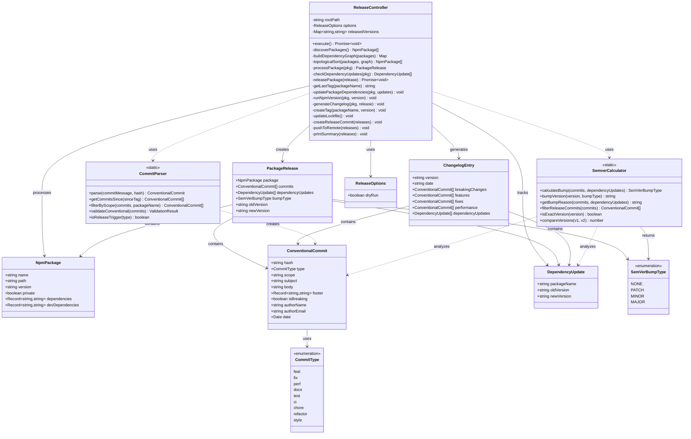
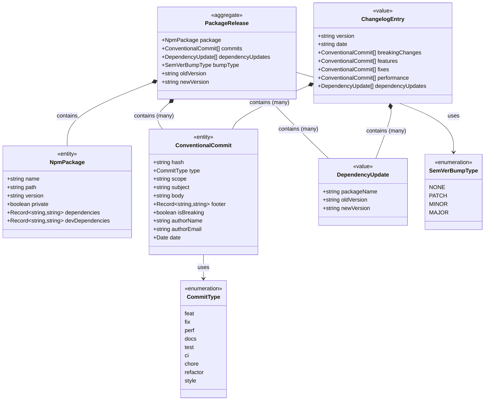
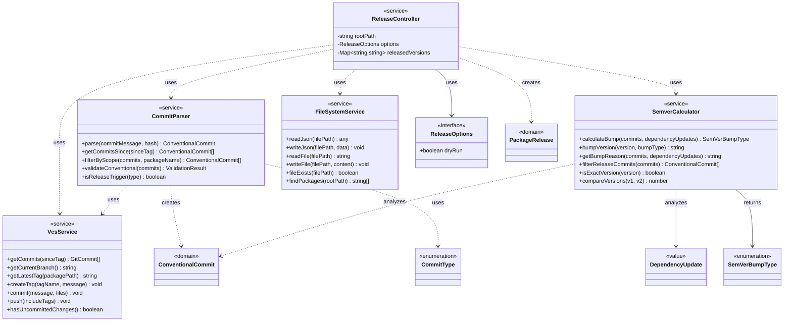
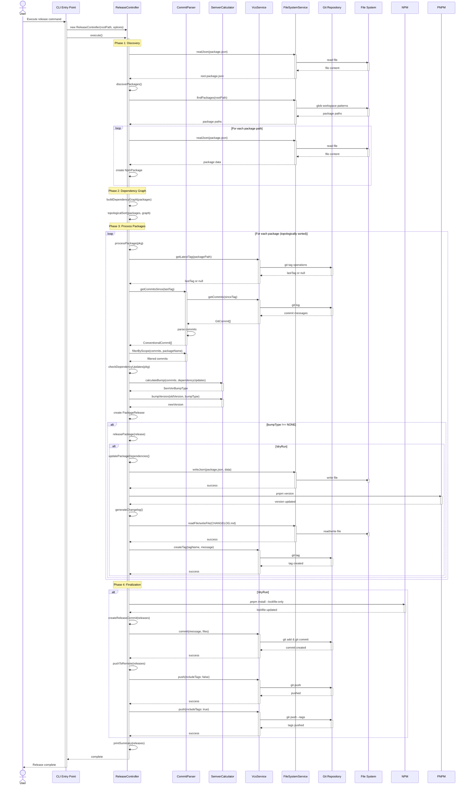
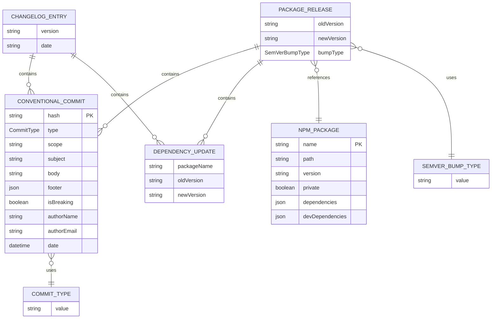

# UML Models for Release Domain

This document contains UML diagrams of the release task domain using Mermaid format. These diagrams render directly on GitHub, GitLab, and in most modern **markdown** viewers.

> **💡 Viewing in Cursor?** Install the "Markdown Preview Mermaid Support" extension, then press `Cmd+Shift+V` (Mac) or `Ctrl+Shift+V` (Windows/Linux) to open the preview. See [`CURSOR-VISUALIZATION.md`](CURSOR-VISUALIZATION.md) for detailed instructions.

## 1. Complete Domain Model

This diagram shows the complete class structure of the release domain, including all classes, interfaces, and their relationships.

## 2. Domain Entities (DDD Model)

This diagram focuses on the core domain entities using Domain-Driven Design concepts, showing aggregates, entities, and value objects.

**Notes:**

- **PackageRelease** is the aggregate root that encapsulates all data needed to perform a release
- **NpmPackage** and **ConventionalCommit** are entities with identity (name/hash)
- **DependencyUpdate** and **ChangelogEntry** are value objects (immutable)

## 3. Service Layer Architecture

This diagram shows the service layer architecture and how services interact with domain entities.

**Service Responsibilities:**

- **ReleaseController**: Main controller implementing the release workflow
- **CommitParser**: Domain service for parsing and validating conventional commits
- **SemverCalculator**: Domain service for semantic version calculations
- **VcsService**: Infrastructure service encapsulating all VCS/Git operations (commits, tags, push, etc.)
- **FileSystemService**: Infrastructure service encapsulating all file system operations (read/write JSON, file I/O, package discovery)

## 4. Release Workflow Sequence

This sequence diagram illustrates the complete release workflow from start to finish.

## 5. Entity Relationship Diagram

This ER diagram shows the relationships between domain entities in a more traditional database-style view.

## Viewing These Diagrams

These Mermaid diagrams will render automatically on:

- **GitHub**: View this file directly in the repository
- **GitLab**: Native Mermaid support
- **VS Code**: Install "Markdown Preview Mermaid Support" extension
- **Online**: Use [Mermaid Live Editor](https://mermaid.live/)
- **Documentation sites**: Most static site generators (Docusaurus, MkDocs, etc.) support Mermaid

## Key Design Patterns

1. **Controller Pattern**: `ReleaseController` coordinates multiple services
2. **Static Utility Classes**: `CommitParser` and `SemverCalculator` provide stateless operations
3. **Value Objects**: Immutable objects like `DependencyUpdate` and `ChangelogEntry`
4. **Aggregate Pattern**: `PackageRelease` groups related entities and value objects
5. **Domain Services**: Services that contain domain logic but don't have state
